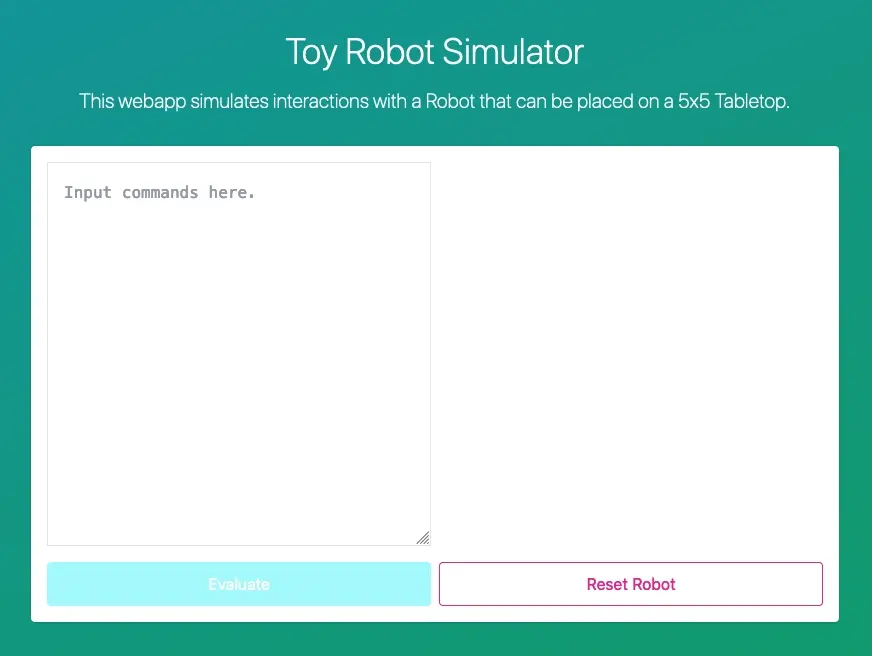

# 🤖 Toy Robot Simulator

Simulates the movement of a hypothetical robot on top of a hypothetical tabletop,
once provided with commands by the user.



This project is meant to address the challenge defined
in [the instructions provided][instructions].

## How it works

In this project, I wanted to explore the process of building a thin client webapp
around a [WebAssembly (WASM)][wasm] module that performed the bulk of the app functionality.
In this case,

- a WASM module built with [Rust][rust] and [`wasm-pack`][wasm-pack] provides abstraction
  of the simulation objects, as well as parsing plaintext commands and managing state
  of the simulation, and
- a thin client built with [React][react] provides the UI for the app.

Both modules are bundled together using [Vite][vite], using a bit of
[package link massaging][build-process].

---

## :rocket::rocket::rocket: TL;DR;

A [`Makefile`][makefile] is provided that streamlines most of the common process work
for this codebase.

If you want to get started as quickly as possible (and provided you have the
[requirements][#requirements] below available on your environment), you can just run the
following to have the app running on your local:

```sh
make serve
```

A production build is also provided in `webapp/dist/` using:

```sh
make
```

## Requirements

You'll need the following tools to use this codebase:

- [Rust][rust] and [`wasm-pack`][wasm-pack] for the WASM module,
- [Node.js][nodejs] for the webapp component (this codebase prefers [`yarn`][yarn],
  but you can use `npm` with some adjustments),
- [`docker`][docker], or an alternative container image builder (e.g. [`podman`][podman])
  if you intend to use the custom build image
- [`jq`][jq] and [`make`][make] if you plan to use the Makefile convenience scripts.

## Building locally

> If you'd just like to try out the webapp locally in your dev environment,
> you can do so quickly via `make` from the project root.
>
> You can also run `make serve` to build and run a dev server with live reloading
> that hosts the web app.

This codebase has two primary sections:

- `wasm/` is the codebase for the WebAssembly module, and
- `webapp/` is the codebase for the webapp thin client.

A third section `buildenv-image/` is provided for building a container image meant as
a build environment for the app in CI environments.

### Compiling the WASM module

> Quick access: `make build-wasm`

Compile the WebAssembly module via [`wasm-pack`][wasm-pack]:

```sh
cd wasm
wasm-pack build --target web -s toy-robot-simulator --release
```

This creates compiled artifacts in `wasm/pkg/` — these will be structured as an
`npm` package, but `package.json` is missing some strongly recommended fields.
Add the following to `package.json`, where `rules_engine.js` is the value in `.module`
in the generated manifest:

```json
{
  "type": "module",
  "main": "rules_engine.js"

  // ...
}
```

### Compiling the webapp

> Quick access: `make build-webapp`

To build the webapp, it will need to be able to resolve where the WASM module is
(by default, it expects `@toy-robot-simulator/rules_engine` to be available).

This is most easily done by linking the `wasm/pkg/` package and `webapp/` projects:

```sh
cd wasm/pkg
yarn link

cd ../../webapp
yarn link @toy-robot-simulator/rules_engine
```

Once the packages are linked, you can build the webapp with:

```sh
yarn build
```

Production build artifacts will be available at `webapp/dist/`.
This folder can then be uploaded to a hosting solution of your choice, using a SPA
or a static webapp configuration.

You can also run a development web server:

```sh
yarn dev
```

## Testing

> Quick access: `make tests`

A handful of test suites are provided in the codebase:

- Code style lints for Rust codebase

  ```sh
  cd wasm
  cargo clippy
  ```

- Unit tests for Rust codebase

  ```sh
  cd wasm
  cargo test
  ```

- Unit tests for WASM modules, constrained to a `wasm` target

  ```sh
  cd wasm
  wasm-pack test --firefox --headless
  wasm-pack test --chrome --headless
  ```

- Code style lints for React / webapp codebase

  ```sh
  cd webapp
  yarn lint
  ```

- Unit tests for React / webapp codebase

  ```sh
  cd webapp
  yarn test
  ```

- Functional testing
  ```sh
  # :: Ensure webapp is running on `localhost:3000` (e.g. via `yarn dev`)
  cd webapp
  yarn cypress open
  ```

---

[build-process]: https://github.com/aws-samples/aws-amplify-webassembly
[docker]: https://docker.com
[jq]: https://stedolan.github.io/jq
[nodejs]: https://nodejs.org
[podman]: https://podman.io
[instructions]: CHALLENGE.md
[make]: https://www.gnu.org/software/make/
[makefile]: Makefile
[react]: https://reactjs.org
[rust]: https://rust-lang.org
[vite]: https://vitejs.dev
[wasm-pack]: https://rustwasm.github.io/wasm-pack/installer/
[wasm]: https://developer.mozilla.org/en-US/docs/WebAssembly
[yarn]: https://yarnpkg.com
